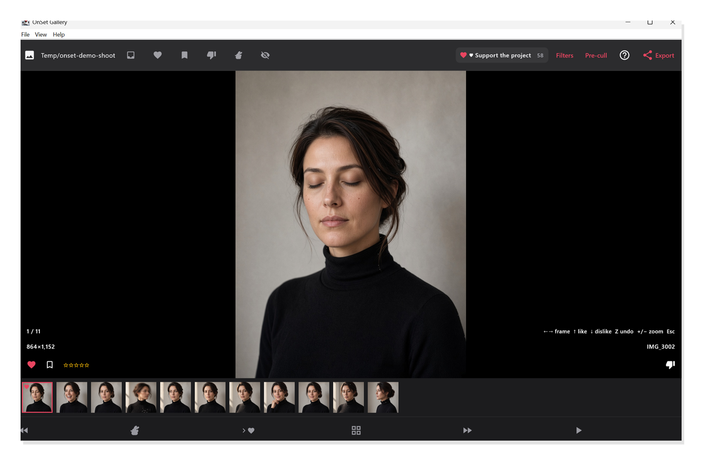

# OnSet Gallery

**High-performance on-set photo cull & review application for photographers, digital techs, and production teams.**

[English](README.md) | [Русский](README.ru.md) | [User Guide](guide.md) | [License](LICENSE.md) | [Privacy Policy](PRIVACY.md)



OnSet Gallery is a professional desktop culling and live review tool designed for commercial, studio, event, and on-location photographers, digital technicians (digitechs), and photo assistants. It eliminates the post-shoot review bottleneck by enabling rapid curation right at the point of capture.

Rate, flag, and filter hundreds or thousands of frames during an active shoot, then instantly export standard XMP sidecar metadata or selection picklists into **Adobe Lightroom Classic** and **Capture One Pro** — completely offline, with zero cloud dependency and zero processing lag.

---

## Key Highlights

- **100% Offline & Private:** Operates entirely on your local workstation. No cloud uploads, no account registration, no telemetry, and no analytics. Your photographs and metadata never leave your computer.
- **Embedded RAW & JPEG Performance:** Displays high-resolution embedded previews from camera RAW files and JPEGs instantly, bypassing slow demosaicing bottlenecks during active shoots.
- **Instant Keyboard Navigation:** Ergonomic single-key shortcuts for ratings, flags, and color labels designed for fast sorting on set.
- **Smart Local Pre-Culling:** Hardware-accelerated local duplicate analysis that automatically flags technical rejects (motion blur, focus misses, closed eyes / unfavorable expressions on macOS) in repetitive bursts while preserving top candidates.
- **Integrated Camera FTP Receiver:** Ingest frames wirelessly over Wi-Fi directly from modern camera bodies (Sony, Canon, Nikon, etc.) into the active session folder.
- **Non-Destructive Metadata Exchange:** Generates industry-standard `.xmp` sidecar files or updates JPEG metadata without altering original camera files or existing development settings.

---

## Why OnSet Gallery?

During commercial shoots, corporate sessions, and high-volume events, successful frames are obvious immediately. However, locating those selections hours later in a bloated catalog often requires sifting through hundreds of repetitive takes.

OnSet Gallery bridges the gap between camera capture and catalog editing:

1. **Live Tethering & Ingest Review:** As the camera transfers files over FTP or tethered folders, "Follow" mode automatically presents the newest incoming frames on your workstation or external client monitor.
2. **On-Set Collaboration:** Hand a laptop or secondary display to art directors, clients, or assistants to mark favorites during breaks without risking catalog corruption or accidental setting changes.
3. **Frictionless Handoff to Lightroom & Capture One:** Export selections as standard XMP sidecars or copy clean filename lists. In your catalog, simply refresh metadata or filter by filename to start editing selected frames immediately.

---

## Feature Overview

| Capability | Description |
| --- | --- |
| **Rapid Keyboard Culling** | Navigate with `←` `→`, like (`↑`), reject (`↓`), favorite (`F`), assign star ratings (`1`–`5`), and undo (`Z`). |
| **Focused Filmstrip Views** | Filter the view by All, Unmarked, Likes, Favorites, or Rejects. Automatically skip or hide rejected frames. |
| **Shoot Overview Grid** | Toggle instantly between single-image inspection and full burst grids (`G`) with adjustable zoom. |
| **Burst Pre-Cull** | Run local duplicate analysis across multi-frame sequences to automatically identify technical flaws. |
| **Universal Metadata Export** | Write `.xmp` sidecars alongside source files, export bundled `.xmp.zip` archives, or copy filename lists to clipboard. |
| **Catalog Compatibility** | Color labels and ratings seamlessly map to **Adobe Lightroom Classic** and **Capture One Pro** (Green = Like, Yellow = Favorite, Red = Reject; Stars: 1–5). |
| **Built-in FTP Receiver** | Lightweight, configurable local FTP server (`:2121`) for direct wireless camera tethering over Wi-Fi. |

---

## Workflow at a Glance

```
  Camera (Wi-Fi FTP / Tether)
             │
             ▼
  Local Session Folder (RAW / JPEG)
             │
             ▼
     OnSet Gallery
  (Instant Culling • Smart Pre-Cull • Ratings)
             │
             ├──► XMP Sidecars (.xmp)
             ├──► Bundled Archive (.xmp.zip)
             └──► Filename Picklist (Clipboard)
             │
             ▼
  Adobe Lightroom Classic / Capture One Pro
  (Immediate post-processing of chosen frames)
```

1. **Open Session:** Launch OnSet Gallery and select your shoot folder (`Ctrl+O` / `⌘O`).
2. **Review & Rate:** Cull with arrow keys and shortcuts. Toggle `Space` for "Follow" mode during tethered capture.
3. **Optional Pre-Cull:** Use automated pre-cull on long burst series to mark obvious rejects.
4. **Export & Sync:**
   - Click **Export** to write `.xmp` sidecars or copy the filename list.
   - In **Lightroom Classic**: Right-click the folder and select **Metadata → Read Metadata from Files**, or paste filenames into the Library filter.
   - In **Capture One**: Enable sidecar syncing under **Preferences → Image**, or use **Select → Select By → Filename List**.

For a complete step-by-step walkthrough with screenshots, see the **[User Guide](guide.md)**.

---

## Installation & System Requirements

Standalone application packages for **macOS** and **Windows** are available on the GitHub Releases page:

👉 **[Download Latest Release](https://github.com/konubrikov/onset-gallery/releases)**

| Platform | Package | Architecture | System Requirements |
| --- | --- | --- | --- |
| **macOS** | DMG | Universal (Apple Silicon & Intel) | macOS 12 Monterey or newer |
| **Windows** | MSI / Standalone Executable | x64 (64-bit) | Windows 10 or 11 (64-bit) |

### macOS Installation

1. Download the `.dmg` installer from the [Releases](https://github.com/konubrikov/onset-gallery/releases) page.
2. Double-click the `.dmg` file to mount the disk image.
3. Drag **OnSet Gallery** into your **Applications** folder.
4. **First Launch & macOS Gatekeeper Notice:**
   - Because preview builds are distributed directly without an Apple Developer ID notarization certificate, macOS Gatekeeper may display a prompt stating: *"OnSet Gallery cannot be opened because the developer cannot be verified"* or *"Apple cannot check it for malicious software"*.
   - **Method A (Standard GUI):** In Finder, open the **Applications** folder, right-click (or `Control`-click) **OnSet Gallery**, and select **Open**. In the pop-up security dialog, click **Open**. This confirmation is only required on initial launch.
   - **Method B (Terminal):** Alternatively, clear the macOS download quarantine attribute by running:
     ```bash
     xattr -cr /Applications/OnSetGallery.app
     ```

### Windows Installation

1. Download the `.msi` or standalone `.exe` installer from [Releases](https://github.com/konubrikov/onset-gallery/releases).
2. Launch the installer and follow the setup wizard prompts.
3. **First Launch & Windows Defender SmartScreen:**
   - Because preview releases are not signed with a paid Extended Validation (EV) certificate, Windows SmartScreen may show a blue alert banner: *"Windows protected your PC"*.
   - Click the **More info** link beneath the warning text.
   - Click the **Run anyway** button that appears.
   - The application will start and function normally without further prompts.

---

## Storage & Privacy

- **Local-Only Storage:** Session indexes, preview references, and rating caches reside strictly in `~/.onset-gallery/` (or `%USERPROFILE%\.onset-gallery` on Windows).
- **Non-Destructive:** Deleting a session inside OnSet Gallery clears only the local application cache. Source photographs in your shoot folder are never deleted or modified.
- **Zero Telemetry:** The application makes no outgoing connections to analytics, tracking, or remote cloud services.

For full details, review our **[Privacy Policy](PRIVACY.md)**.

---

## Legal & Licensing

- **License:** OnSet Gallery is proprietary software distributed free of charge (**Freeware**) for both personal and commercial use under the [End User License Agreement](LICENSE.md).
- **Disclaimer of Warranty & Limitation of Liability:** The software is provided "AS IS", without warranties of any kind. Nikita Konubrikov shall not be liable for any damages or data loss resulting from its use. See [LICENSE.md](LICENSE.md) for full terms.
- **Trademark Notice:** Adobe, Lightroom, and Lightroom Classic are trademarks or registered trademarks of Adobe Inc. Capture One is a registered trademark of Capture One A/S. Sony, Canon, Nikon, Apple, macOS, Microsoft, and Windows are trademarks or registered trademarks of their respective owners. Reference to these trademarks is strictly for descriptive compatibility purposes and does not imply sponsorship, endorsement, or affiliation.
- **Open Source Attribution:** OnSet Gallery utilizes open-source components under permissive licenses (MIT, Apache 2.0, BSD). Respective notices and license texts are bundled in distribution packages.
