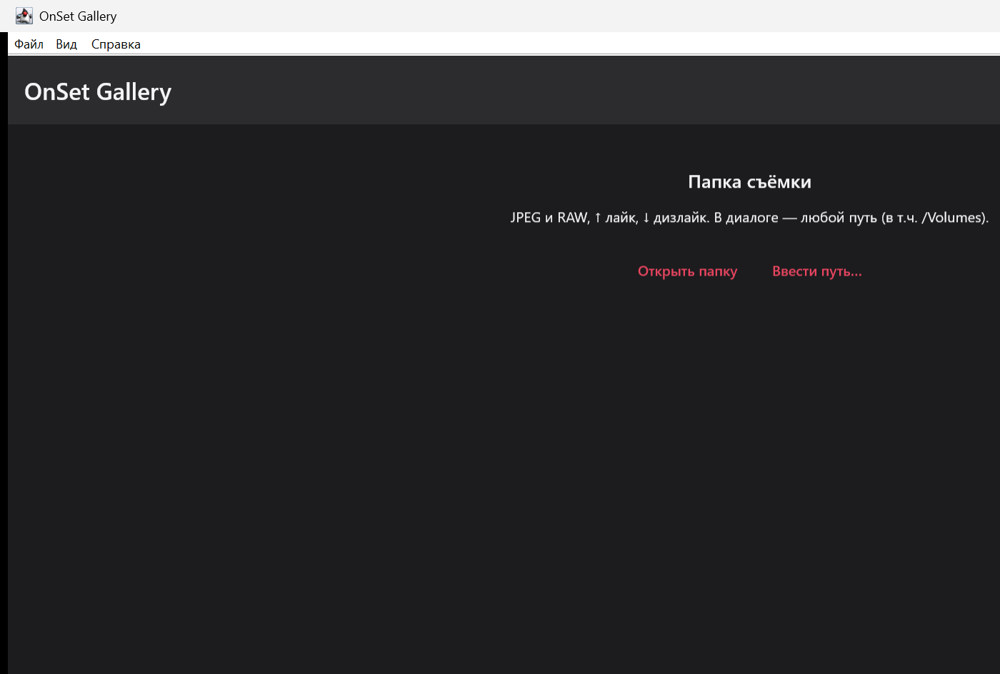
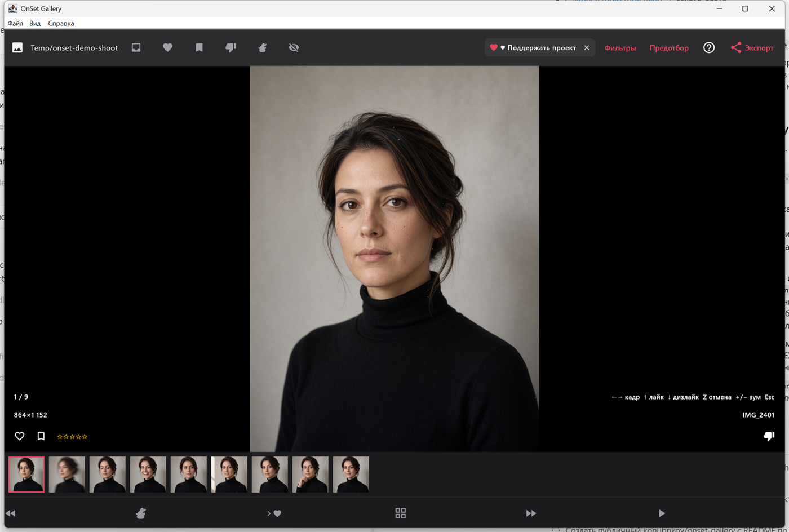
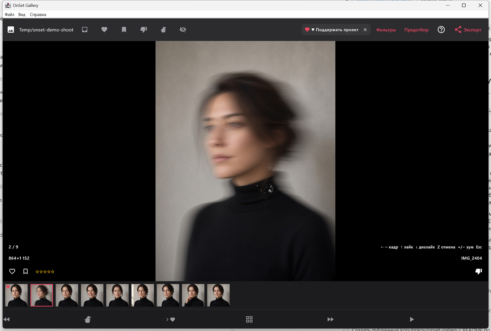
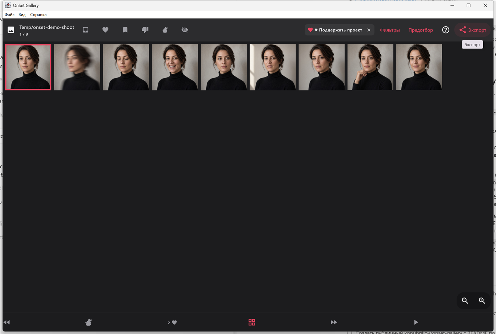
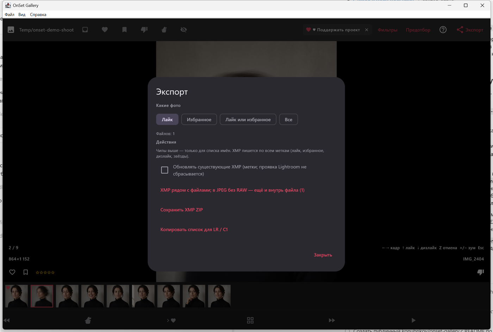

# Как отбирать в OnSet Gallery

Короткий проход по экранам desktop-версии для macOS и Windows. Кадры на картинках — демонстрационная серия, снятая для этой инструкции: один и тот же человек, одна стена, девять дублей. У вас вместо неё будет папка своей съёмки.

Программа не загружает фотографии. Отбор остаётся на компьютере, в `~/.onset-gallery/`. Удаление сессии стирает только метки OnSet, файлы в папке съёмки не трогает.

## 1. Открыть папку

После запуска, если сессий ещё нет, OnSet просит папку съёмки. В ней должны лежать JPEG или RAW. RAW в ленте показывается по встроенному превью, не как полная проявка.

Два входа:

- **Открыть папку** — обычный выбор каталога. То же самое в меню **Файл → Открыть папку** или `Ctrl+O` (`⌘O` на Mac).
- **Ввести путь…** — если папка на подключённом томе и в диалоге её неудобно искать. Нужен абсолютный путь.

Папку можно перетащить на окно. Повторное открытие той же папки возвращает уже существующую сессию, а не создаёт вторую.

## 2. Листать и отмечать

Сессия открывается лентой. Внизу — плёнка всех кадров, крупно — текущий. Счётчик слева показывает номер, имя файла и размер превью.

Клавиши, которыми это делается на площадке:

| Клавиша | Действие |
| --- | --- |
| `←` `→` | предыдущий / следующий кадр |
| `↑` | лайк |
| `↓` | дизлайк |
| `F` | избранное |
| `1`–`5` | звёзды |
| `Z` | отменить последнюю метку |
| `G` | плитка |
| `+` / `−` | зум |
| `0` | вписать в окно |
| `Esc` | назад к списку сессий |

Лайк, дизлайк и избранное видны на плёнке. На снимке ниже вверх поставлен лайк смазанному дублю: сердце на миниатюре стало красным, кадр в ленте — второй из девяти.

Сверху ленты — быстрые фильтры: только неотмеченные, только лайки, только избранное, только дизлайки. Рядом два режима для брака: проскакивать дизлайкнутые (они остаются в плёнке, но стрелки перепрыгивают их) или скрыть совсем.

`Space` включает «Следить»: лента держится на последних пришедших кадрах, это нужно, когда камера ещё пишет в папку.

## 3. Плитка

`G` или кнопка плитки внизу показывает серию целиком. Так видно, где дубли, а где уже другой поворот головы. Щипок или кнопки масштаба меняют размер клеток.

На этой серии девять кадров одной точки: прямой взгляд, моргание, смех, смаз, взгляд в сторону, прищур, три четверти, рука у лица, улыбка. Предотбор как раз для такого ряда. Он включается кнопкой **Предотбор** внутри сессии и сам ставит дизлайк слабым дублям: смаз, промах, а на macOS ещё и неудачное лицо. На Windows лица он не считает, только технику кадра. Уже поставленные вами метки он не переписывает и в короткой серии обязательно оставляет несколько кадров без дизлайка. Считается на компьютере, без облака.

## 4. Отдать выбор в каталог

**Экспорт** собирает метки так, чтобы их прочитал Lightroom Classic или Capture One.

Чипы «Лайк», «Избранное», «Лайк или избранное», «Все» относятся к **списку имён**. Сами XMP пишутся по всем меткам: лайк, избранное, дизлайк и звёзды.

Три действия:

- **XMP рядом с файлами.** Для RAW появляется sidecar. Если RAW нет и в папке только JPEG, те же метки пишутся ещё и внутрь JPEG. Уже существующую проявку OnSet не затирает: в готовый XMP дописываются только метки. Галка «Обновлять существующие XMP» нужна, когда sidecar уже лежит рядом.
- **Сохранить XMP ZIP** — тот же пакет, если файлы надо унести на другой компьютер. ZIP распаковывается в папку съёмки, имя к имени.
- **Копировать список для LR / C1** — имена файлов в буфер.

Как прочитать это в каталоге:

- Lightroom Classic: выделить папку → Metadata → Read Metadata from Files. Пару RAW+JPEG не разбивайте: метка должна сесть на RAW.
- Capture One: Preferences → Image, чтение sidecar XMP. Список имён: Select → Select By → Filename List.
- Список в Lightroom: Library → Text → Filename → Contains, вставить имена.

Соответствие меток: лайк — зелёная, избранное — жёлтая, дизлайк — отклонённый кадр и красная, звёзды — рейтинг 1–5. Русский Lightroom узнаёт подписи «Зеленый», «Желтый», «Красный».

## 5. Камера по FTP

Кнопка FTP в списке сессий поднимает сервер на этом компьютере. В диалоге видны IP, порт (по умолчанию 2121) и логин с паролем — их и вводите в FTP-клиенте камеры. На Mac разрешите входящие в настройках брандмауэра. Логин и пароль хранятся на диске открытым текстом, в `~/.onset-gallery/ftp-settings.json`, и никуда не отправляются.

Камера кладёт JPEG в папку сервера. Сессия может смотреть в ту же папку или в другую. «Следить» в ленте тогда показывает новые кадры, как они приходят.

## Чего ждать от версии 0.9.0

- Скан папки: глубина до 6 уровней и не больше 4000 кадров за проход.
- Отбор на компьютере, телефоне и планшете не синхронизируется.
- Сборки для macOS и Windows лежат в [Releases](https://github.com/konubrikov/onset-gallery/releases). Подпись и notarize делаются вручную, поэтому система может спросить подтверждение при первом запуске.
- На новой установке сверху бывает плашка «Поддержать проект». Ключ вставляется в приложении и проверяется на устройстве. Фотографии из-за этого не уходят в сеть.
