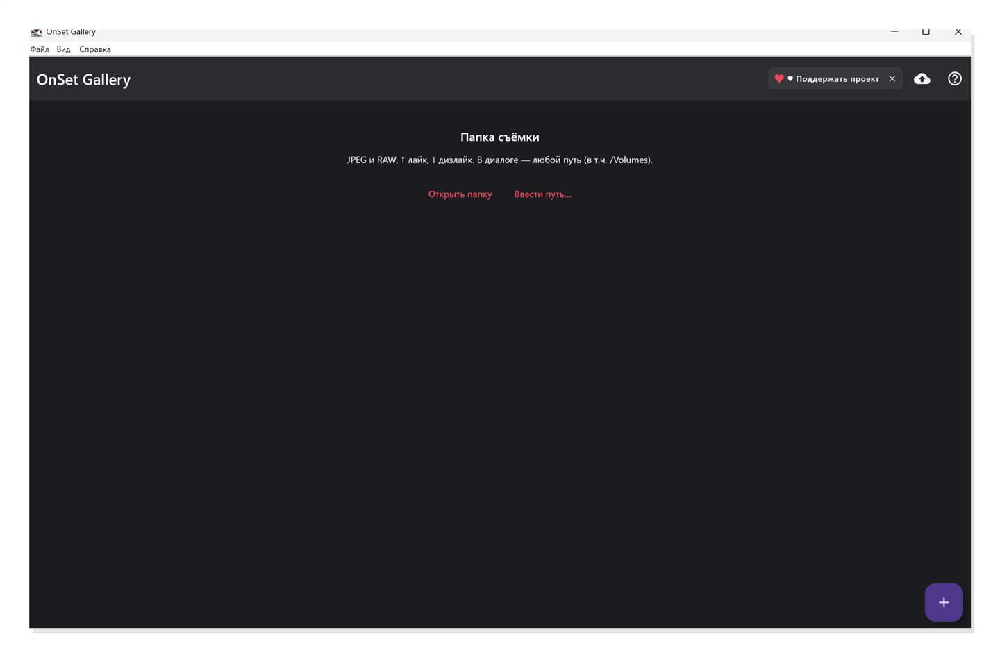
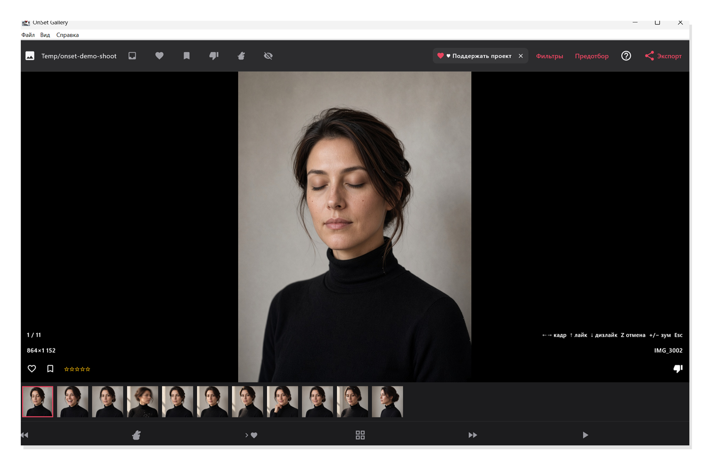
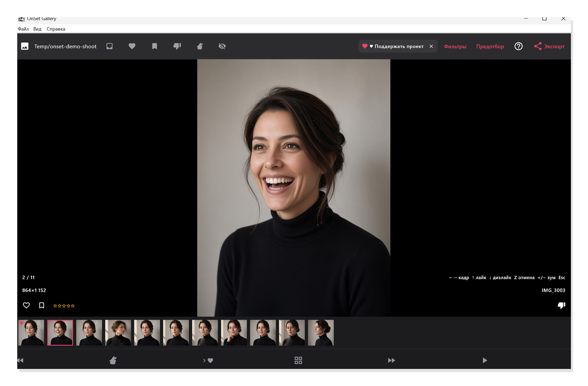
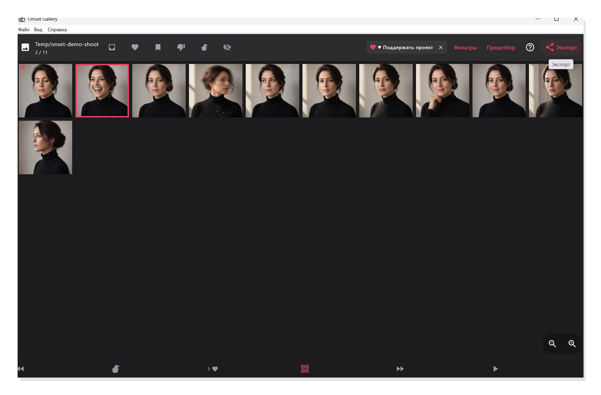
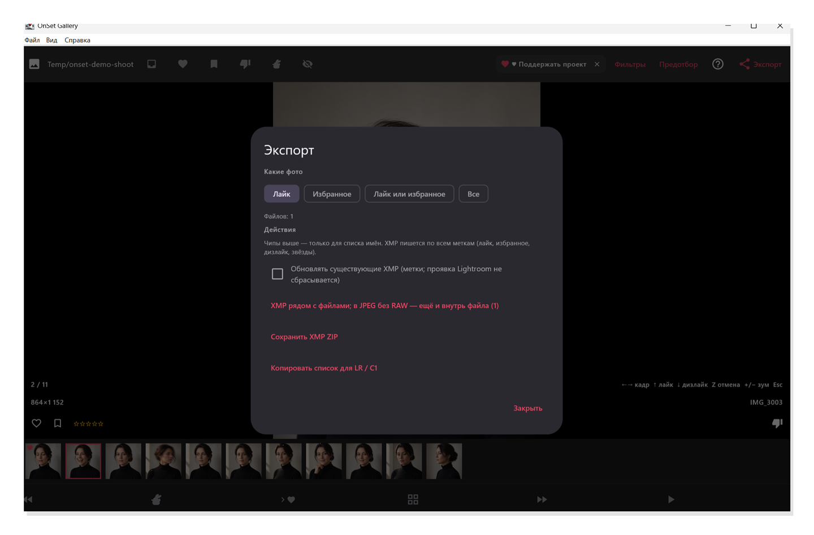

# Руководство пользователя OnSet Gallery

[English](guide.md) | [Русский](guide.ru.md) | [README](README.ru.md)

В данном руководстве подробно описаны установка и рабочий процесс в OnSet Gallery для macOS и Windows: от инсталляции и открытия папки со съёмкой до экспорта стандартизированных метаданных в Adobe Lightroom Classic и Capture One Pro.

OnSet Gallery работает полностью локально. Индексы сессий, превью и выставленные метки сохраняются на вашем компьютере в каталоге `~/.onset-gallery/` (или `%USERPROFILE%\.onset-gallery` на Windows). Удаление сессии внутри программы удаляет только локальный рабочий кэш; исходные файлы съёмки остаются нетронутыми.

---

## 1. Установка и первый запуск

Скачайте установочный пакет со страницы **[Релизов GitHub](https://github.com/konubrikov/onset-gallery/releases)**.

### macOS (macOS 12 Monterey или новее)
1. Загрузите пакет `.dmg` и откройте его двойным кликом.
2. Перетащите иконку **OnSet Gallery** в папку **«Программы» (Applications)**.
3. **Обход предупреждения macOS Gatekeeper при первом запуске:**
   - Поскольку тестовые preview-сборки не содержат платной подписи Apple Developer ID, система macOS Gatekeeper может показать предупреждение: *«Не удается открыть приложение OnSet Gallery, так как не удалось проверить разработчика»*.
   - **Способ 1 (через Finder):** Откройте папку **«Программы»**, нажмите правой кнопкой мыши (или с зажатой клавишей `Control`) на иконку **OnSet Gallery** и выберите **«Открыть»**. В появившемся окне подтверждения нажмите кнопку **«Открыть»**. (Действие требуется выполнить только один раз; при последующих запусках программа открывается как обычно).
   - **Способ 2 (через Терминал):** Если система блокирует запуск, снимите атрибут карантина командой:
     ```bash
     xattr -cr /Applications/OnSetGallery.app
     ```

### Windows (Windows 10 / 11 64-bit)
1. Загрузите файл инсталлятора `.msi` или исполняемый `.exe`.
2. Запустите файл и выполните шаги мастера установки.
3. **Обход предупреждения Windows Defender SmartScreen:**
   - Для тестовых сборок без коммерческого EV-сертификата фильтр Windows Defender SmartScreen может показать синее окно защиты: *«Система Windows защитила ваш компьютер»*.
   - Нажмите ссылку **«Подробнее»** (More info).
   - Нажмите появившуюся кнопку **«Выполнить в любом случае»** (Run anyway).
   - Приложение запустится в штатном режиме.

---

## 2. Открытие папки со съёмкой

При первом запуске OnSet Gallery (или при отсутствии активных сессий) стартовое окно предлагает выбрать целевой каталог съёмки. Папка может содержать стандартные файлы JPEG или RAW с камеры (`.ARW`, `.CR2`, `.CR3`, `.NEF` и др.). RAW-кадры отображаются по встроенным превью высокого разрешения, что обеспечивает максимальную скорость работы.



Способы открытия сессии:

- **Открыть папку:** стандартный диалог выбора папки в системе. Также доступен через меню **Файл → Открыть папку** или сочетание `Ctrl+O` (`⌘O` на macOS).
- **Ввести путь…:** прямой ввод абсолютного пути (удобно при работе с сетевыми хранилищами или внешними подключёнными накопителями).
- **Перетаскивание (Drag & Drop):** перетащите папку со съёмкой из проводника или Finder прямо в окно программы.

*Примечание: повторное открытие ранее отсканированной папки мгновенно открывает существующую сессию с сохранёнными оценками.*

---

## 3. Просмотр и быстрая навигация с клавиатуры

После выбора папки открывается основной экран галереи: текущий кадр в высоком разрешении, нижняя лента миниатюр всей серии и статусная строка с номером кадра, именем файла и размером превью.



Управление процессом отбора оптимизировано для работы с клавиатуры одной рукой:

| Клавиша | Действие |
| --- | --- |
| `←` / `→` | Предыдущий / следующий кадр |
| `↑` | **Лайк** (зелёная метка) |
| `↓` | **Отклонение** (красная метка + флаг отклонённого кадра) |
| `F` | **Избранное** (жёлтая метка) |
| `1` – `5` | Рейтинг звёздами (от 1 до 5 звёзд) |
| `Z` | Отменить последнее действие |
| `G` | Переключение между лентой и обзорной сеткой (Grid) |
| `+` / `−` | Увеличение / уменьшение масштаба |
| `0` | Вписать изображение в окно |
| `Space` | Включить режим **«Следить»** (автоскролл к новым входящим кадрам) |
| `Esc` | Возврат к списку сессий |

Выставленные оценки сразу отображаются на активном изображении и на миниатюрах в ленте:



### Быстрые фильтры и обработка отклонённых кадров
В верхней части ленты расположены чипы фильтрации:
- **Все кадры**
- **Только неотмеченные** (удобно для последовательного разбора)
- **Лайки** / **Избранное** / **Отклонённые**

Рядом находятся переключатели режима обработки брака:
- **Проскакивать отклонённые:** кадры остаются в ленте, но при листании стрелками программа автоматически переходит через них.
- **Скрыть отклонённые:** полностью исключает забракованные дубли из ленты, чтобы не возвращаться к ним повторно.

При съёмке в компьютер или по Wi-Fi FTP включите режим **«Следить»** (`Space`), чтобы программа автоматически показывала вновь поступающие кадры.

---

## 4. Обзорная сетка и умный предотбор (Pre-Cull)

Нажатие клавиши `G` или кнопки сетки в нижней панели переключает интерфейс в режим плиточного обзора. В нём удобно оценивать серии дублей, сравнивать композицию и фазы движения.



### Автоматический предотбор
При серийной съёмке быстро накапливаются десятки однотипных дублей. Функция **Предотбор** запускает локальный алгоритмический анализ серии:

- **Технические параметры:** программа оценивает резкость, смаз и корректность экспозиции в рамках последовательности кадров.
- **Оценка мимики (macOS):** на macOS система анализирует лица, автоматически отмечая закрытые глаза и неудачные выражения лица. На Windows анализ выполняется по оптическим характеристикам и экспозиции.
- **Безопасность меток:** предотбор никогда не перезаписывает оценки, поставленные вручную, и гарантированно оставляет лучших кандидатов в каждой серии.
- **100% оффлайн:** все вычисления выполняются на локальном процессоре без отправки данных в сеть.

---

## 5. Экспорт в Adobe Lightroom Classic и Capture One Pro

Нажмите кнопку **Экспорт** на верхней панели инструментов для передачи разметки в ваш графический редактор или каталог.



### Варианты экспорта

1. **XMP рядом с файлами:**
   - Для RAW-файлов программа создаёт стандартизированные файлы `.xmp` в папке съёмки.
   - Для отдельных JPEG-файлов (без пары RAW) метаданные могут дополнительно записываться внутрь заголовков файла.
   - Если рядом уже есть готовый `.xmp` (например, с профилем камеры или кадрированием), OnSet Gallery дополняет его метками рейтинга, не затирая существующие параметры проявки.
2. **Сохранить архив XMP ZIP:**
   - Упаковывает все сгенерированные `.xmp` в один архив. Удобно для быстрой отправки меток ретушёру или на другой компьютер.
3. **Копировать список для LR / C1:**
   - Копирует список имён выбранных файлов (Все, Лайки, Избранное или Лайки + Избранное) в буфер обмена для мгновенной фильтрации в каталоге.

### Чтение метаданных в каталогах

#### Adobe Lightroom Classic
1. Выделите папку съёмки в модуле Library.
2. В верхнем меню выберите **Metadata → Read Metadata from Files**.
3. Lightroom применит цветовые метки и рейтинги к кадрам.
4. *Альтернативно:* используйте фильтр библиотеки **Library → Find by Filename → Contains** и вставьте скопированный список имён.

#### Capture One Pro
1. В **Preferences → Image → Metadata** убедитесь, что включена синхронизация Sidecar XMP (режим **Sync** или **Auto Sync**).
2. Фильтрация по списку имён: перейдите в **Select → Select By → Filename List** и вставьте скопированный список.

### Таблица соответствия метаданных

| Оценка в OnSet Gallery | Тег в метаданных XMP | Lightroom Classic | Capture One Pro |
| --- | --- | --- | --- |
| **Лайк** (`↑`) | `xmp:Label="Green"` | Зелёная метка | Зелёная метка |
| **Избранное** (`F`) | `xmp:Label="Yellow"` | Жёлтая метка | Жёлтая метка |
| **Отклонение** (`↓`) | `xmp:Label="Red"` + Reject Flag | Красная метка / Отклонённый | Красная метка / Rejected |
| **Звёзды** (`1`–`5`) | `xmp:Rating="1..5"` | Рейтинг 1–5 звёзд | Рейтинг 1–5 звёзд |

---

## 6. Приём кадров с камеры по Wi-Fi FTP

Современные камеры (Sony, Canon, Nikon) поддерживают фоновую передачу файлов по Wi-Fi FTP. OnSet Gallery содержит встроенный приёмник FTP, что исключает необходимость настройки сторонних серверов.

1. В окне списка сессий нажмите кнопку **FTP** для вызова настроек сервера.
2. В окне отобразится локальный IP-адрес вашего компьютера, порт (по умолчанию `2121`), логин и пароль.
3. Укажите эти параметры в настройках передачи по FTP в меню камеры.
4. В качестве каталога загрузки укажите папку текущей съёмки.
5. Откройте эту папку в OnSet Gallery и включите режим «Следить» (`Space`). Поступающие кадры будут появляться на экране в реальном времени.

*Безопасность: FTP-сервер принимает подключения исключительно внутри локальной сети. Данные не передаются во внешнюю сеть интернет.*

---

## 7. Технические параметры и ограничения

- **Глубина сканирования:** обход вложенных каталогов выполняется до 6 уровней глубины.
- **Рекомендуемый объём:** сессия оптимизирована для быстрой работы с массивами до 4 000 кадров за один проход.
- **Отображение RAW:** для мгновенной отрисовки используются встроенные JPEG-превью полного разрешения из RAW-файлов (без ожидания дебайеринга).
- **Поддерживаемые форматы:** JPEG (`.jpg`, `.jpeg`) и основные форматы RAW (`.arw`, `.cr2`, `.cr3`, `.nef`, `.dng`, `.orf`, `.rw2`).
- **Сохранность оригиналов:** программа не перемещает, не переименовывает и не удаляет исходные файлы фотографий.
